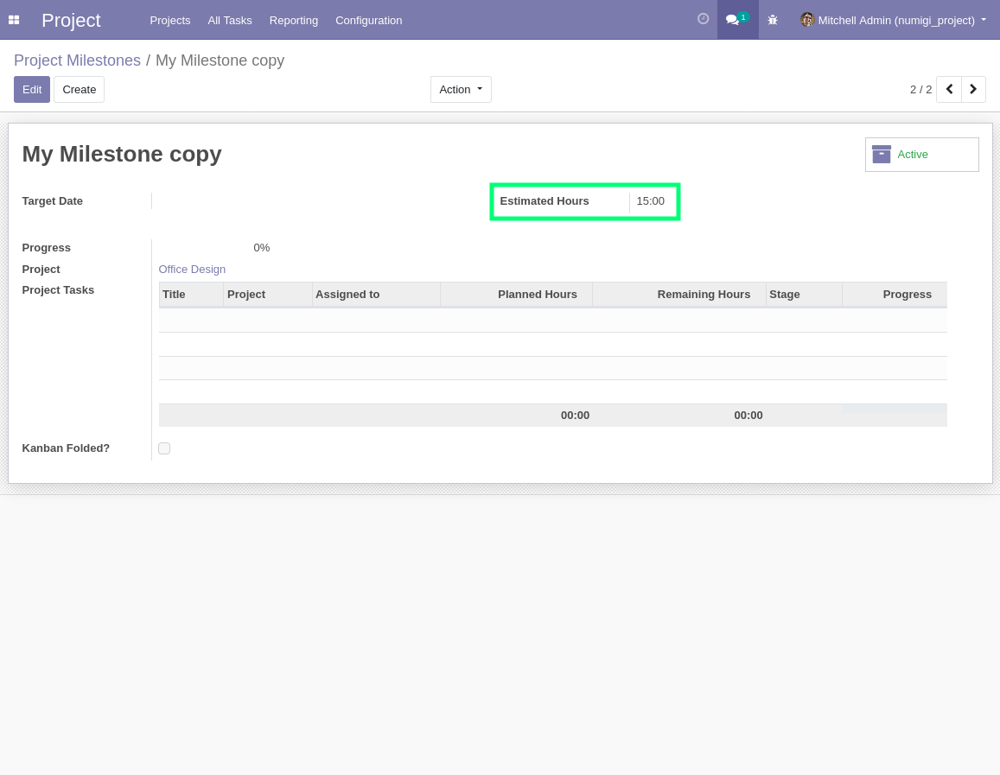

=================================
Project Milestone Estimated Hours
=================================

.. contents:: Table of Contents

Context
-------

The module `project_milestone <https://github.com/OCA/project/tree/14.0/project_milestone>`_ allows to define milestones for a project.

Multiple tasks in the project can be linked to a given milestone.

Description
-----------

Field estimated hours is displayed in form and list view of a project milestone and in tab of milestones of a project.
when a milestone is copied, value of estimated hours is copied too.

Overview
--------

I open the form of a project milestone and set value in field "Estimated hours.

.. image:: static/description/project_milestone_form.png

I copy the milestone and value in field "Estimated hours is the same.

I open the list of milestones, the field is displayed.

.. image:: static/description/project_milestone_tree.png

I open the form of a project with notebook milestones, the field is displayed.

.. image:: static/description/project_form.png

Credits
=======

Authors
-------

* Numigi

Contributors
------------

-  Numigi (tm) and all its contributors (https://bit.ly/numigiens)

Maintainers
-----------

This module is maintained by the OCA.

.. image:: https://odoo-community.org/logo.png
   :alt: Odoo Community Association
   :target: https://odoo-community.org

OCA, or the Odoo Community Association, is a nonprofit organization whose
mission is to support the collaborative development of Odoo features and
promote its widespread use.

This module is part of the `OCA/project <https://github.com/OCA/project/tree/14.0/project_milestone_estimated_hours>`_ project on GitHub.

You are welcome to contribute. To learn how please visit https://odoo-community.org/page/Contribute.
