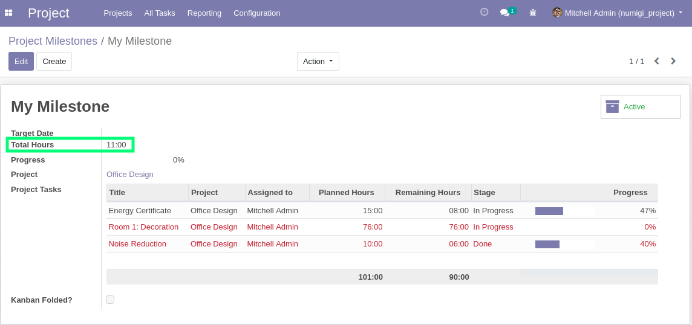

As a `Project/User`, I create timesheets and set duration for 2 tasks associated to the same milestone.

I open the milestone, the field Total hours is set with sum of timesheets spent hours of associated tasks

