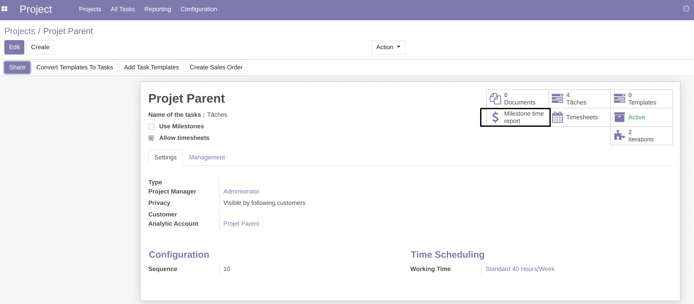
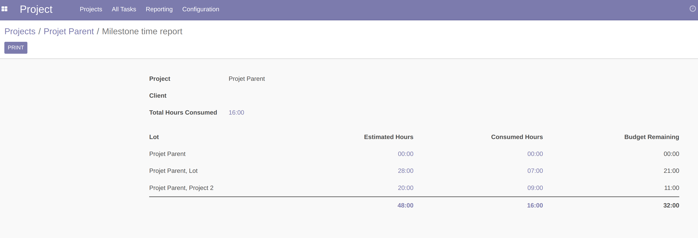
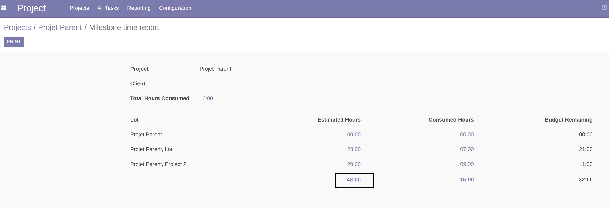
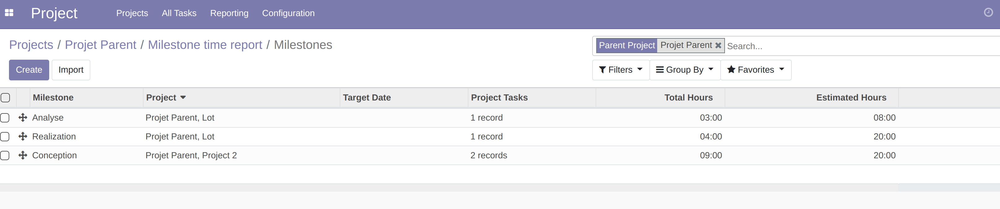
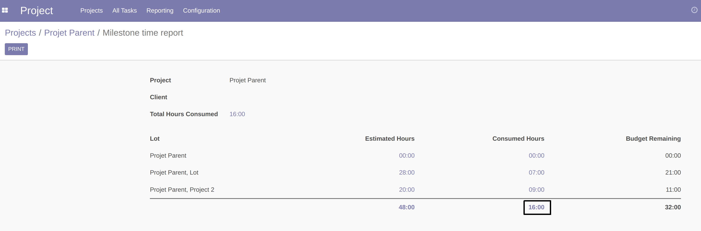
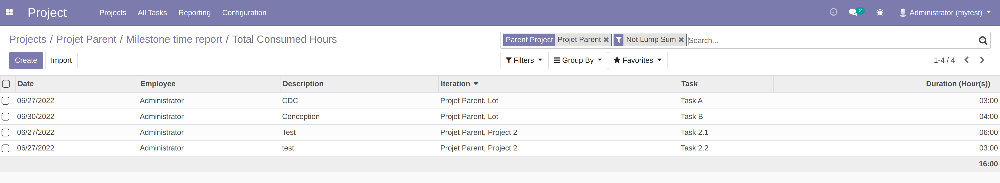
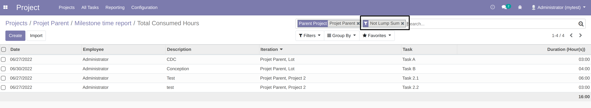

Go to the form view of a project.

A new smart button 'Milestone Time Report' is available.

Click on the button. The report is displayed.

- Estimated Hours

When clicking on an amount of estimated hours, the list of milestones composing this amount is displayed.

- Consumed Hours

When clicking on an amount of consumed hours, the list of analytic lines composing this amount is displayed.

- Lump Sum Projects

When a sub-project is a lump sum, it is excluded from the report.

See module project_lump_sum for more details.